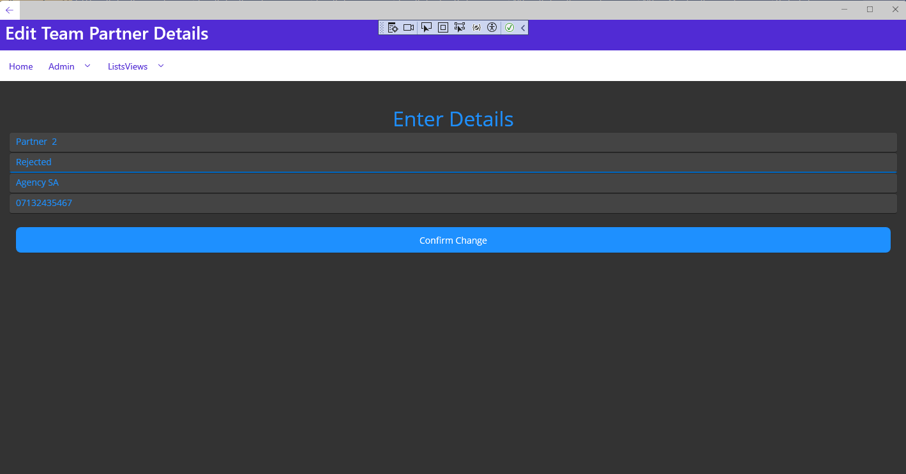

# Week 10: Team Project 03

## Issue [#88](https://github.com/xinjoonha/SET09102_PURPLE/issues/88)

This week, my focus was on addressing the following user story:

**Title:** As an UNDAC Deputy Team Leader, I want to view details of all team partners so that I can contact them immediately.

**End User Goal:** To be able to contact partners as efficiently as possible.

**Acceptance Criteria:**

- Partners can be listed with their current association status (e.g., 'requested,' 'confirmed,' etc.).
- Agency details can be viewed easily.
- Full-text search can be used to filter the list of partners.
- Filters can be cleared.

For a more detailed overview of the issue, you can check the [original issue description](https://github.com/edinburgh-napier/SET09102/blob/main/practicals/issues/week_8.md).

## Work Summary
I fulfilled the necessary acceptance conditions after finishing the current task.
I thoroughly examined the description before getting to work on my issue. When it was done, I sent a pull request, which can be viewed [here](https://github.com/xinjoonha/SET09102_PURPLE/pull/92).

<br>
*Figure 1: My Pull Request.*


### 1. Listing Team Partners

#### AllTeamPartnersPage

The `AllTeamPartnersPage` class effectively displays a list of Team Partners, showcasing their current association status. This page provides a clear and organised view of Team Partners, meeting the requirement for easy listing.

This implementation allows for a straightforward presentation of Team Partners, offering transparency regarding their association status. The use of the `TeamPartnersListView` enhances the user experience, ensuring a coherent and accessible representation of the data.

### 2. Viewing Agency Details

#### TeamPartner Class and TeamPartnerRepository

The `TeamPartner` class and the corresponding repository (`TeamPartnerRepository`) contribute to the easy retrieval of agency details for each Team Partner. This class has the following attributes: *Id, Name, Status, Agency, and Contact Number*. 

```csharp
    /// <summary>
    /// This class contains the TeamPartner object's template
    /// </summary>
    [Table("team_partner")]
    public class TeamPartner : IIdentifiable
    {
        [PrimaryKey, AutoIncrement]
        public int Id { get; set; }
        public string Name { get; set; }
        public string Status { get; set; }
        public string Agency { get; set; }
        public string ContactNumber { get; set; }
    }
```

The design of the `TeamPartner` model and its storage in the repository enable seamless access to agency details, aligning with the requirement. This implementation promotes efficient information retrieval, enhancing the overall functionality of the system.

```csharp
    /// <summary>
    /// This class manages the TeamPartnerRepository
    /// </summary>
    public class TeamPartnerRepository : Repository<TeamPartner>, ITeamPartnerRepository
    {
        /// <summary>
        /// Constructor for the TeamPartnerRepository class
        /// </summary>
        /// <param name="database">An instance of the database</param>
        public TeamPartnerRepository(SQLiteAsyncConnection database) : base(database) { }
    }
```

### 3. Full-text Search and Filtering

#### AllTeamPartnersPage and TeamPartnerRepository

The `AllTeamPartnersPage` incorporates a full-text search mechanism through the `FullTextSearchBar`. The `FilterTeamPartners` method efficiently filters Team Partners based on the provided text.

The implementation allows users to perform dynamic searches on Team Partners, meeting the full-text search requirement. The clear filtering option ensures a user-friendly experience. This approach contributes to a responsive and flexible system, accommodating user preferences for data exploration.
```csharp
    /// <summary>
    /// This method applies filters to a list of items
    /// </summary>
    /// <param name="allTeamPartners">a list of team partners</param>
    /// <returns></returns>
    public List<TeamPartner> ApplyFilters(List<TeamPartner> allTeamPartners)
    {
        if (!string.IsNullOrWhiteSpace(FullTextSearchBar.Text))
        {
            string skillFilter = FullTextSearchBar.Text.ToLower();
            allTeamPartners = allTeamPartners.Where(teamPartner => teamPartner.Name.ToLower().Contains(skillFilter)).ToList();
        }

        return allTeamPartners;
    }
```

### 4. CRUD Operations

#### AllTeamPartnersPage and EditTeamPartnerPage

The `AllTeamPartnersPage` and `EditTeamPartnerPage` classes collectively handle the CRUD operations for Team Partners. `AddTeamPartner_Clicked` in `AllTeamPartnersPage` and `OnStatusChanged` in `EditTeamPartnerPage` manage the addition, deletion, and update of Team Partners.

The implementation adheres to the CRUD principles, enabling the creation, retrieval, updating, and deletion of Team Partners in a systematic manner. The orchestration between the `AllTeamPartnersPage` and `EditTeamPartnerPage` classes establishes a consistent and intuitive user interface, facilitating smooth interactions with Team Partner data.

<br>
In order to improve readability and maintainability, I also made sure that my implementation of this issue followed clean code standards. The following are the main clean code guidelines I adhered to:

- **Modularity and Cohesion:** In my code, classes exhibit single responsibility, promoting modularity and cohesion.
Additionally, the separation of data layer, models, and views adheres to the principle of modularity, enhancing maintainability.

- **Code Consistency:** Consistent coding style and formatting across the project. Consistency enhances code readability, making it easier for team members to understand and collaborate.

- **Clear and Concise Methods:** Methods are clear and concise with well-defined purposes. It goes withour saying that clear methods improve code readability and understanding, contributing to maintainability.

- **Testable Code:** Code is designed to be testable, with separation of concerns. Testable code facilitates effective unit testing, promoting robustness.


### Results

The problem criteria were effectively addressed by my implementation, which lets users examine, filter, and change Team partners. Screenshots of my implementation are shown below:

<br>
*Figure 2: Team Partners Page.*

<br>
*Figure 3: Filtering Team Partners.*

<br>
*Figure 4: Changing Team Partner Details.*


## Code Testing

Implemented a set of tests to ensure the reliability and functionality of the code:

- **AddTeamPartnerTestAsync:** Verified the successful addition of a team partner to the database.

- **AddInvalidTeamPartnerTestAsync:** Tested the system's ability to reject an invalid team partner.

- **DeleteTeamPartnerTestAsync:** Confirmed the proper deletion of a team partner from the database.

- **GetTeamPartnerTestAsync:** Validated the retrieval of team partners from the database.

## Code Reviews

### Code Review provided by me
I reviewed the code submitted by one of my teammates, [Marco Vavassori](https://github.com/Vavuz) and I found some issues. Although the errors were minor, I made sure to include a comprehensive description and also a reference resource for my teammate to look at regarding [Naming conventions](https://learn.microsoft.com/en-us/dotnet/standard/design-guidelines/capitalization-conventions?redirectedfrom=MSDN).

While reviewing his implementation, I also noticed a typo on his implementation, so I made sure to let him know.
His Pull Request with my comments can be found [here](https://github.com/xinjoonha/SET09102_PURPLE/pull/91).

<br>
*Figure 5: Changes Requested by me*

### Code Review Received
During this week, I also received feedback from Marco. In this case, it was regarding the `AddInvalidTeamPartnerTestAsync` test. The concern was about the lack of input validation for the `TeamPartner` object, potentially making the test failed.
I changed the test by adding a failing data type in name, which caused the issue to identify invalid Team Partners.
<br>
*Figure 6: Changes Requested to me*

## Reflection

### Achievements

- **Clean Code Practices:** I conscientiously applied clean code principles throughout the project, prioritising readability and maintainability. This not only enhanced the quality of the group code but also facilitated smoother collaboration within the team.

- **Expanded Repository and Model Classes:** Taking initiative, I extended the data layer by introducing the `ITeamPartnerRepository` and `TeamPartnerRepository`. Simultaneously, I crafted the `TeamPartner` model class, amplifying the project's structure.

- **Comprehensive Testing:** To ensure the robustness of my implementation, I dedicated time to implement a comprehensive suite of tests. This, together with the feedback I received in order to enhance my tests, contributed to the project's reliability.

### Challenges and Solutions

- **Validation Oversight:** Recognizing an oversight in input validation, I acknowledged the need for stricter checks. This week I definitely improved in testing, as I realised that my tests were not entirely functional. I had to spend more time working on them and refining them, which helped me improve in this area.

### New Insights

- **Team Development Dynamics:** Exploring the dynamics of team development, I encountered challenges and actively sought solutions. This experience provided valuable insights into collaborative coding practices, shaping my perspective on effective teamwork and shared project ownership.
During this week, I actively talked to my teammates and we discussed the idea of trying to implement a new pattern from next week.

## Links

- [Link to Team's GitHub Repository](link-to-team-repository)

## References

- [Clean Code: A Handbook of Agile Software Craftsmanship by Robert C. Martin](https://www.goodreads.com/en/book/show/3735293-clean-code)