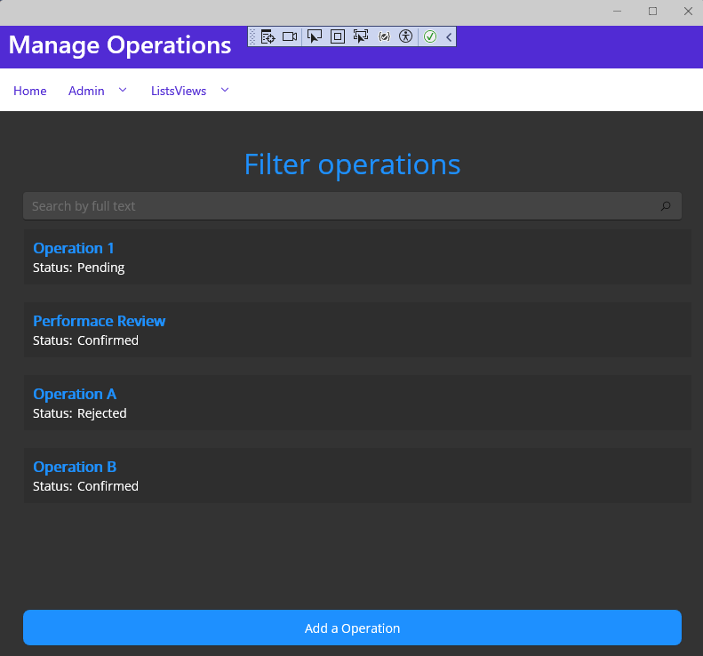
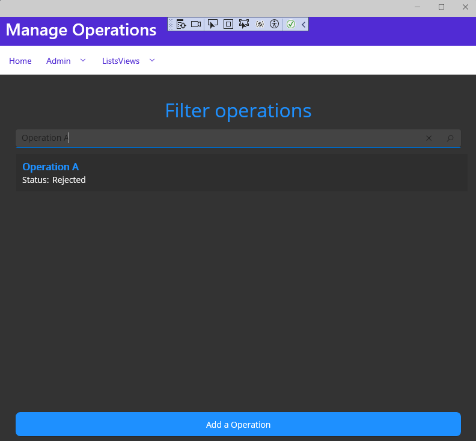
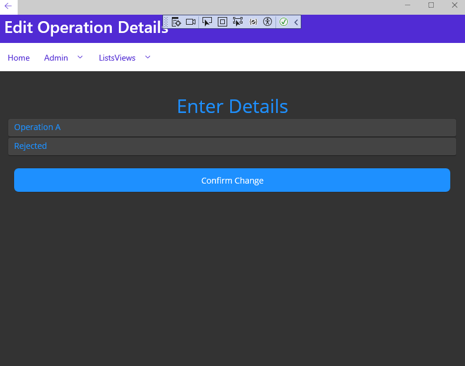
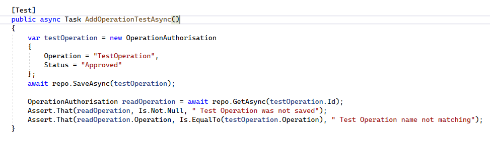
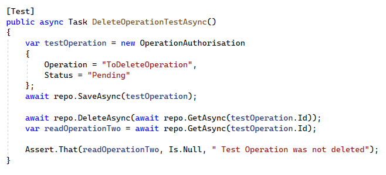
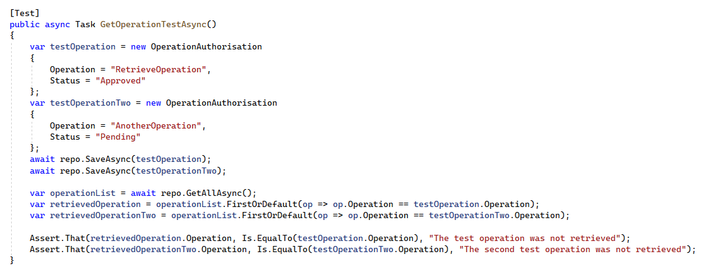
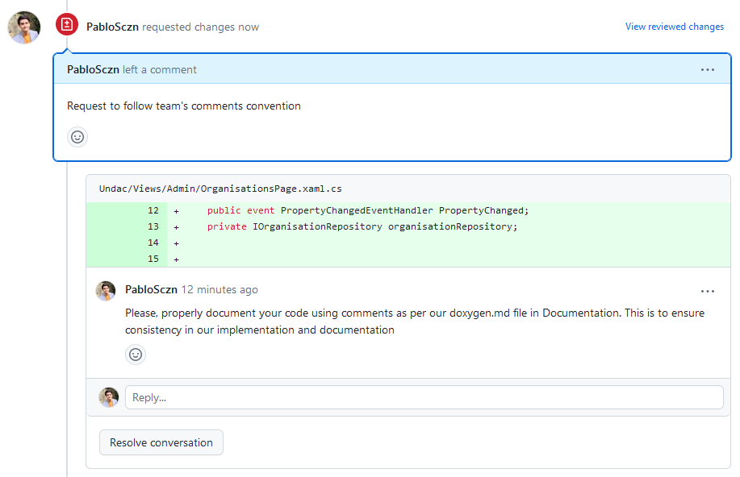
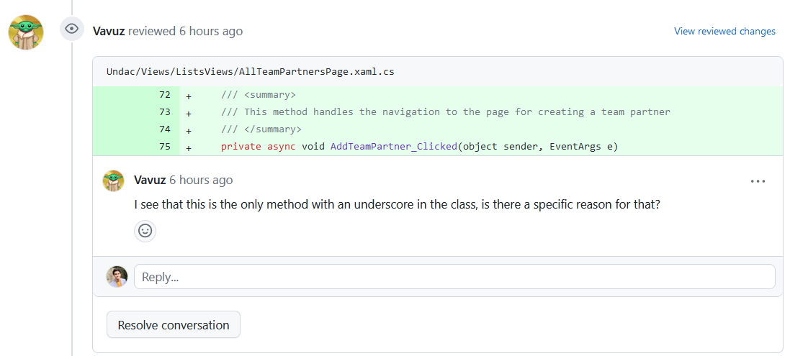

# Week 11: Team Project 04

## Issue [#101](https://github.com/xinjoonha/SET09102_PURPLE/issues/101)

This week, I addressed a critical issue related to the management of operational authorisation statuses. The issue's end user goal was to enable the listing, creation, updating, and deletion of reference values for operational authorisation statuses. The associated business goal aimed at having appropriate statuses available for describing operational authorisations.

### Acceptance Criteria

- Operational authorisation status items can be created, viewed, updated, and deleted (CRUD functionality).
- Unit tests pass for all CRUD operations.

For detailed information, refer to the [original issue](https://github.com/edinburgh-napier/SET09102/blob/main/practicals/issues/week_3.md).

## Work Summary

I successfully implemented the required functionality, meeting all acceptance criteria. My approach involved focusing on clean code practices, incorporating a systematic personal workflow, and actively participating in the team's agreed-upon UI structure.

### Code Implementation

#### Model and Repository
The `OperationAuthorisationRepository` class and its associated repository, `OperationAuthorisationRepository`, facilitate the acquisition of agency particulars for every Operation. 

```csharp
using SQLite;

namespace Undac.Models
{
    /// <summary>
    /// This class contains the OperationAuthorisation object's template
    /// </summary>
    [Table("operational_authorisation_status")]
    public class OperationAuthorisation : IIdentifiable
    {
        [PrimaryKey, AutoIncrement]
        public int Id { get; set; }
        public string Operation { get; set; }
        public string Status { get; set; }
    }
}
```

#### Views

I created the `AllOperationsPage` class to manage the listing, filtering, and navigation of operational authorisation statuses. Additionally, I implemented the `EditOperationPage` for creating and updating these operations. The code adheres to modular design practices, emphasising clean code principles. <br>

I added these two classes to the ListViews directory, as a user would not need to be Admin in order to access the pages

#### Test Code Summary

I developed comprehensive unit tests to ensure the reliability of the implemented functionality. The tests cover adding, deleting, and retrieving operational authorisations, ensuring the code's robustness.


## Results

My implementation successfully met the issue requirements, allowing users to perform CRUD operations on operational authorisation statuses. Screenshots of the implemented functionality are available below:

- 
  *Figure 1: Operations Page.*

- 
  *Figure 2: Filtering Operations.*

- 
  *Figure 3: Editing Operation Status.*

## Code Testing

I implemented the following unit tests:

- **AddOperationTestAsync**
  -  <br>
  *Figure 4: Add Operation Test.*

- **DeleteOperationTestAsync**
  -  <br>
  *Figure 5: Delete Operation Test.*

- **GetOperationTestAsync**
  -  <br>
  *Figure 6: Get Operation Test.*

## Code Reviews

### Code Review Provided by Me

I conducted a code review for my teammate Mateusz. Feedback focused on the comments, as his implementation did not adhere to the team's documentation guidelines. <br>
 <br>
*Figure 7: Changes Requested by me*

### Code Review Received

I received positive feedback during the code review process. However, there were minor issues identified by Marco, leading to improvements in my implementation. I was lacking consistency in the naming of my methods and my teammate made me notice that


*Figure 8: Changes Requested by Marco*

## Reflection

### Common Problems in Team Development

Working in a team development situation, we encountered and observed some common problems:

1. **Coding Style Conflicts:** Inconsistent coding styles among team members could lead to confusion and code that is challenging to read and maintain. We addressed this by establishing and following coding conventions consistently.

2. **Differing Skill Levels:** Varying levels of coding and experience among team members were evident. Providing continuous support and feedback helped bridge gaps and maintain a collaborative environment.

3. **Scope Creep:** Expanding the project scope beyond what was initially planned can lead to delays. We managed scope by continue working on some Week 3 issues.

## Reflection on our Workflow

As we continue to work with the GitHub Flow workflow, it's evident that our collaborative efforts are on the right track. However, there are a few areas where we can make our process even smoother:

### 1. **Reviewer Assignment**

Assigning a reviewer to a pull request is crucial, but it seems this step may sometimes be overlooked. To improve, we should ensure that every pull request has a designated reviewer. This could involve setting up reminders or notifications.

### 2. **Code Review Efficiencies**

Our code review process is outlined well, but sometimes it takes longer than needed. We should find a way to encourage timely feedback and find a way to address reviews causing delays. Setting expectations for review completion times could also be helpful.

### 3. **Code Review Responses**

While we mention responding to code reviews, we could emphasise the importance of acknowledging feedback promptly. This creates a collaborative environment and helps resolve issues efficiently.

### 4. **Branch Deletion Consistency**

Deleting branches after merging is suggested, but there might be inconsistency. Reinforcing the importance of branch deletion in our workflow could help maintain consistency.

### 5. **Continuous Learning**

Encouraging continuous learning and knowledge sharing within the team can enrich our collaboration. We should then sonsider sharing insights gained during the development process, including lessons learned, challenges faced, and solutions found.

### Conclusion

While the GitHub Flow has been a solid foundation, addressing these suggestions can make our development process even smoother. 

## References

- [Clean Code: A Handbook of Agile Software Craftsmanship by Robert C. Martin](https://www.goodreads.com/en/book/show/3735293-clean-code)

## Team Repository

- Code Repository: [Link to GitHub Repository](https://github.com/xinjoonha/SET09102_PURPLE)