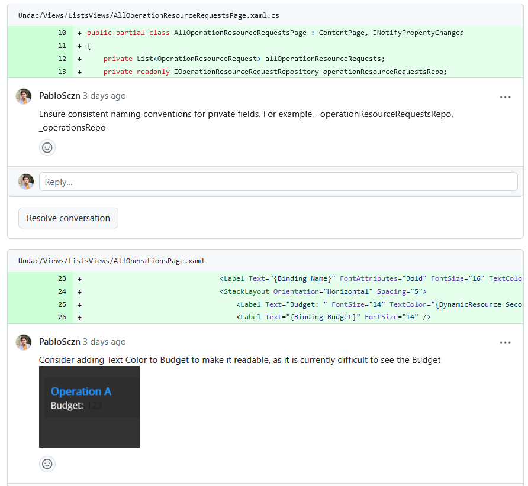
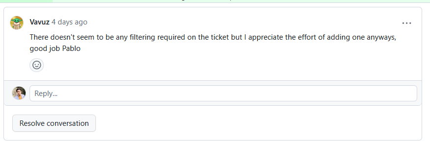

# Week 12: Team Project 05

This week, I delved into reshaping our codebase to align with the new direction that our team took to the Model-View-ViewModel (MVVM) architecture. For this purpose, I changed the code of the issue from last week (Issue [#101](https://github.com/xinjoonha/SET09102_PURPLE/issues/101)), and implemented the MVVM model.

During this week, I worked on two crucial components: the `OperationAuthorisationRepository` and the `AllOperationsPage` view. To the first, I had to make changes on the code wrote for last week's issue, and I had to perform changes on specific database types like SQLiteAsyncConnection. I, therefore implemented lazy initialization and future-proofing our system for potential shifts to different databases. This was not just a code change; it was a strategic move to break free from the constraints of specific database technologies.

For `AllOperationsPage`, I made changes to embrace dependency injection and the MVVM paradigm. I changed the page so instead of instantiating repositories directly, it now accepts injections of dependencies, enhancing clarity and modularisation.

## Repository Refactoring

### Before:

```csharp
using SQLite;
using Undac.Models;

namespace Undac.Data.Repositories
{
    public class OperationAuthorisationRepository : Repository<OperationAuthorisation>, IOperationAuthorisationRepository
    {
        public OperationAuthorisationRepository(SQLiteAsyncConnection database) : base(database) { }
    }
}
```

### After:

I transitioned from using `SQLiteAsyncConnection` to our custom `UndacDatabase`. This change facilitates lazy initialization, easing the process of future adaptations to different database types like SQL Server. I also implemented dependency injection, allowing for cleaner and more modular code.

```csharp
using Undac.Data.Repositories;
using Undac.Models;

namespace Undac.Data.Repositories
{
    public class OperationAuthorisationRepository : Repository<OperationAuthorisation>, IOperationAuthorisationRepository
    {
        private readonly Lazy<IUndacDatabase> _undacDatabaseLazy = new Lazy<IUndacDatabase>(() => App.Database.Database);

        public OperationAuthorisationRepository() : base() { }

        private IUndacDatabase UndacDatabase => _undacDatabaseLazy.Value;

        // CRUD methods using UndacDatabase (lazy-initialised)
    }
}
```

## View Refactoring

### Before:

```csharp
using Undac.Data.Repositories;
using Undac.Models;

namespace Undac.Views.ListsViews
{
    public partial class AllOperationsPage : ContentPage
    {
        // ... (last week's code)
    }
}
```

### After:

To embrace dependency injection and conform to MVVM principles, I made several significant changes to the `AllOperationsPage`:

1. Removed direct instantiation of the repository, allowing for automatic dependency injection.
2. Utilized dependency injection in the constructor, receiving `IOperationAuthorisationRepository` as a parameter.
3. Eliminated unnecessary repetitive repository initialization within methods.
4. Incorporated MVVM pattern by ensuring a clear separation of concerns.

```csharp
using Undac.Data.Repositories;
using Undac.Models;

namespace Undac.Views.ListsViews
{
    public partial class AllOperationsPage : ContentPage
    {
        private List<OperationAuthorisation> allOperations;
        private readonly IOperationAuthorisationRepository operationAuthorisationsRepo;

        public AllOperationsPage(IOperationAuthorisationRepository repo)
        {
            InitializeComponent();
            operationAuthorisationsRepo = repo;

            // ... (last week code)
        }

        // ... (last week code)
    }
}
```

## Code Reviews

### Code Review Provided by Me

Apart from working on this renovation. I took the time to give feedback to one of my teammates. <br>
The changes I requested were not huge, as my teammate did a great job. I only requested changes to ensure consistency in the naming and to make sure that the text in the application was readable.
 <br>
*Figure 1: Changes Requested by me*

### Code Review Received

I received positive feedback during the code review process. My teammate highlited to my my job in implementing filtering on the CRUD implementation. Although this was not needed, I implemented it to improve our application and make it more user friendly.


*Figure 2: Changes Requested by Marco*


## Reflection

### Achievements

- I successfully implemented MVVM pattern, improving code maintainability.
- Transitioned from specific database type to a more abstract `IUndacDatabase` for enhanced flexibility.
- Adopted dependency injection for cleaner and more modular code.

### Challenges and Solutions

- **Challenge:** Adapting existing repository code to use lazy initialization and a more abstract database interface.
  - **Solution:** Conducted in-depth research, leading to a more efficient and extensible design.

- **Challenge:** Refactoring the view to utilize dependency injection and eliminate repetitive repository instantiation.
  - **Solution:** Implemented constructor injection and removed redundant repository initialization, enhancing code clarity.

### Connection to Previous Work

Last week, I worked on addressing the end user and business goals related to operational authorisation statuses. I successfully implemented CRUD functionality and ensured the passage of unit tests for each operation. This week's MVVM refactoring builds on that work, creating a more organized and modular codebase that aligns with our team's evolving workflow.

## References

- [MVVM Documentation](https://docs.microsoft.com/en-us/xamarin/xamarin-forms/enterprise-application-patterns/mvvm)
- [Dependency Injection in MAUI](https://docs.microsoft.com/en-us/dotnet/maui/dependency-injection)
- [UndacDatabase Repository](https://github.com/yourusername/yourrepository/path/to/UndacDatabase.cs)
- [AllOperationsPage View](https://github.com/yourusername/yourrepository/path/to/AllOperationsPage.cs)
