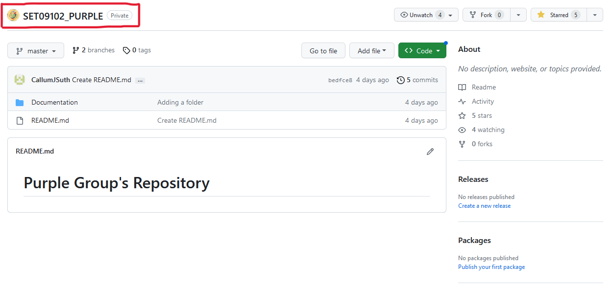

# Week 2 (11/09/23): Environment Setup and Configuration

## Environment Configuration

### Development Environment Setup

In week 2, I focused on setting up my development environment to ensure it was correctly configured for the course's collaborative requirements. This involved several key tasks, which I've documented below.

#### Task 1: Creating a Shared GitHub Repository with the Team

- **Screenshot:** 
  <figcaption align = "center"><b>Fig.1 Shared GitHub repository</b></figcaption>
  
  <br>
  This screenshot shows our team's shared GitHub repository. It was essential to establish this repository to centralize our project work and collaborate efficiently.

- **Commentary:** The screenshot displays our shared repository's main page. This repository is where our team will store and manage all project-related code, documentation, and issues. It acts as a centralized hub for our collaboration.

#### Task 2: Setting up a Project in GitHub with an Integrated Task Board

- **Screenshot:** 
  <figcaption align = "center"><b>Fig.2 GitHub Integrated Task Board</b></figcaption>
  
  <br>
  This screenshot showcases our GitHub project board, created to track and manage tasks during the project's development.

- **Commentary:** We utilized GitHub Projects to create a project board that provides an organized view of our tasks. This board helps us visualize our workflow, assign tasks, and monitor progress throughout the course.

#### Task 3 & 4: Configuring Visual Studio

- **Screenshot:** 
  <figcaption align = "center"><b>Fig.3 Visual Studio with Repo configured</b></figcaption>
  
  <br>
  
  This screenshot exhibits my personalized Visual Studio IDE configuration.

- **Configuration:** Configuring Visual Studio was crucial to ensure a consistent development environment across the team. This screenshot highlights my chosen settings, extensions, and themes, tailored to maximize productivity.

- **Cloning:** Cloning the repository locally is an essential step to access, modify, and contribute to our project. This screenshot captures the moment I initiated the clone operation.

### Reflection

Setting up the development environment and configuring GitHub were essential steps to kickstart our collaborative project. Here, I reflect on my experience and discuss some key points:

#### Limitations and Challenges

During the setup process, we faced some challenges. It took us a while to understand all the tasks and to ensure that everyone was on the
same page. Additionally, we faced a challenge when synchronising our IDE configurations. These challenges taught us valuable lessons
about collaboration and helped us to know each other.

#### Appropriateness of Configuration

We managed to create a desirable environment configuration, including Visual Studio and GitHub, which aligns with the project's
requirements. It also promotes a seamless workflow and ensures all team members are on the same page.

#### Alternative Configurations

While our current setup is suitable for this project, further tasks could require further configurations. Therefore, we have come as a team to
understand how each of us works and how we can improve our resilience during the course of the module.

#### Resolution of Difficulties

We successfully resolved most of the challenges we encountered during setup through effective communication and collaboration within the team. This experience highlighted the importance of teamwork and adaptability.

In conclusion, week 2's focus on environment setup and configuration has laid a solid foundation for our collaborative project. It has equipped us with the tools and knowledge needed to work efficiently as a team. Moving forward, we are well-prepared to tackle the project's technical challenges and deliver high-quality results.


### Entry Submission

#### Converting md file to PDF

In order to submit this entry, I am converting this md file to PDF with the help of NPM.
As this Markdown has images, I have used the markdown-pdf package to convert this file to pdf
```
npm install -g markdown-pdf
markdown-pdf week2_setup.md
```
