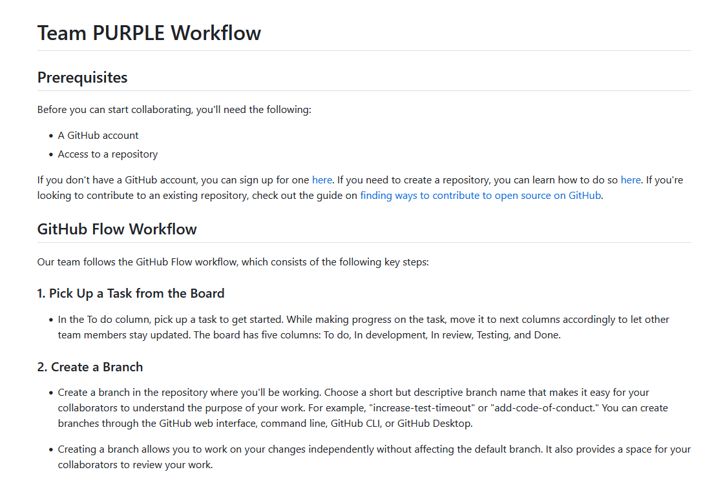

# Week 3: GitHub Workflow Mastery

## Workflow

In this week's entry, I will document my practical work in mastering GitHub's workflow tools as part of my coursework. The main objectives were to demonstrate my ability inusing GitHub's workflow tools and successfully executing this week's tasks, which include:

- Familiarising myself with C# and .NET MAUI
- Accepting a task from the project backlog
- Updating task information appropriately
- Maintaining the task board accordingly
- Completing development tasks on feature branches
- Validating work against the Definition of Done (DoD)

## C# and .NET MAUI
For this practical, I familiarised myself with C# and .NET MAUI. For that, I did a couple of tutorials, which helped me to understand the task. The tutorials can be found in the following links
* [Getting started](https://learn.microsoft.com/en-us/dotnet/maui/tutorials/notes-app/)
* [Adding a databse](https://learn.microsoft.com/en-us/dotnet/maui/data-cloud/database-sqlite)

 
*Figure 1: My first .NET MAUI app* 

### Task Workflow
**1. Standard Workflow**

To begin, we decided as a team a standard workflow which everyone should follow in order to collaborate. All the details of the Workflow can be found on the Team repo

*Figure 2: Team Workflow Preview*

**2. Accepting a Task from the Project Backlog**

I accessed our team project's backlog and selected a task, which involves C# and .NET MAUI by building a test app using an SQLite database.
As explained in my last entry, the Backlog is made in Github Projects 

*Figure 3: Task Selection from Backlog*

**3. Updating Task Information**

I ensured that the task's details were up to date and relevant to my work. This involved clarifying the objectives and expectations for the task.

 

*Figure 4: Updating Task Information*

**4. Task Board Management**

I actively participated in maintaining the task board by moving the selected task to the "In Development" column to signal that I had started working on it.

 

*Figure 5: Task Board Update*

**5. Completing Development Tasks on Feature Branches**

I created a feature branch specifically for this task, allowing me to isolate my work from the main codebase while working on the SQLite database integration.

 

*Figure 6: Feature Branch Creation*

**6. Checking Work Against Definition of Done (DoD)**

After some development, I reviewed my work against the Definition of Done (DoD) to verify that it met the required criteria and was ready for integration into the main codebase. As it was not ready yet, I did not push the changes and waited until next practical to practice coding.

## Reflection

This week's practical work helped me to gain a better understanding of GitHub's workflow tools and their importance in collaboraion. However, I did face some challenges, such as understanding the way that issues work on Github and understanding the concept of Github Flow. To overcome this, I asked for guidance to my team members, and they provided me with some help.

Regarding the current workflow process, I believe it is generally effective but I also think it could benefit from clearer task descriptions in the backlog and improved guidance on the Definition of Done. Additionally, we should implement continuous integration (CI) to the project, which we will probably do soon.

In conclusion, mastering GitHub's workflow tools is key in ensuring a successful and collaborative process for our team. Definitely, As I continue to work on the course, I look forward to refining and improving these processes for future weeks and practicals.
