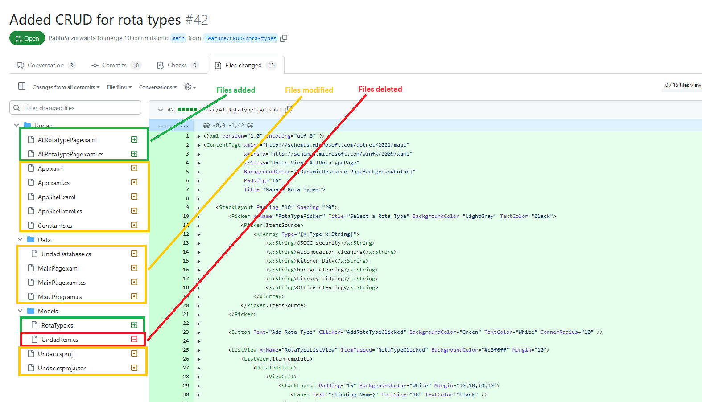
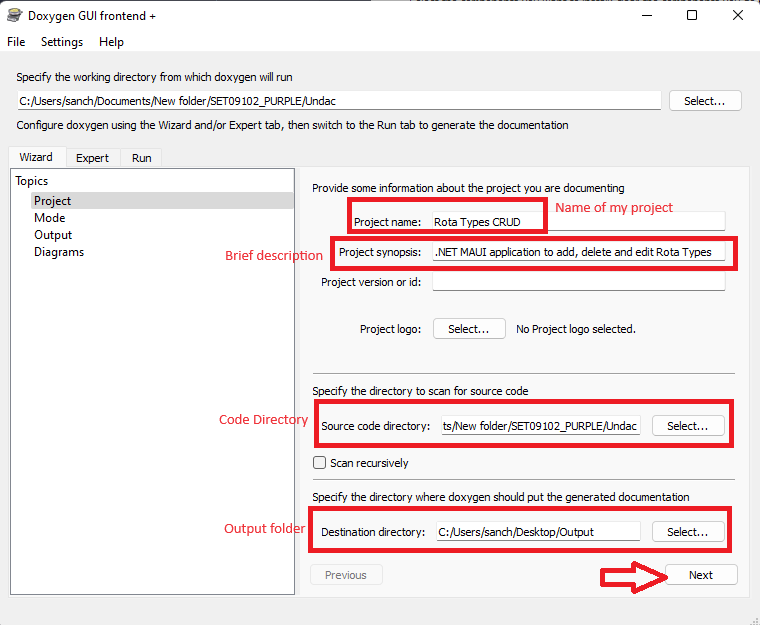

# Clean Code & Documentation - Week 5

## Background
As specified during Week 3, I have coded one of the task of the team's project backlog and I have refined it, with comments and further enhancements. <br>
For that code, I have then created a [Pull Request](https://github.com/xinjoonha/SET09102_PURPLE/pull/42) <br>

<br>

*Figure 1: Creating a Pull Request from Visual Studio.*
<br>


<br>

*Figure 2: My Pull Request.*
<br>

My changes were significant to the Group Project, as I added and modified various files, which were crucial for the adequate functioning of the overall code.



<br>

*Figure 3: My contribution to the Group code.*
<br>

## The code
In this week's portfolio entry, I will reflect on my progress in applying clean code principles and improving code documentation within my code. 

On this entry, I will summarise six clean code rules, and explain how I've implemented these rules effectively. Furthermore, I'll showcase the generated Doxygen documentation.

But before diving into the details, let's have a look at the code I will be reviewing.

``` C#
using SQLite;
using Undac.Models;

namespace Undac.Data
{
    public class UndacDatabase
    {
        SQLiteAsyncConnection Database;

        public UndacDatabase()
        {
        }

        async Task Init()
        {
            if (Database is not null)
                return;

            Database = new SQLiteAsyncConnection(Constants.DatabasePath, Constants.Flags);
            var result = await Database.CreateTableAsync<RotaType>();
        }

        public async Task<List<RotaType>> GetItemsAsync()
        {
            await Init();
            return await Database.Table<RotaType>().ToListAsync();
        }

        public async Task<RotaType> GetItemAsync(int id)
        {
            await Init();
            return await Database.Table<RotaType>().Where(i => i.ID == id).FirstOrDefaultAsync();
        }


        public async Task<int> SaveItemAsync(RotaType item)
        {
            await Init();
            if (item.ID != 0)
                return await Database.UpdateAsync(item);
            else
                return await Database.InsertAsync(item);
        }

        public async Task<int> DeleteItemAsync(RotaType item)
        {
            await Init();
            return await Database.DeleteAsync(item);
        }
    }
}

```

This is the code for the UndacDatabase class, which I modified the most, in order to manage 'RotaType' objects using SQLite.

## Rules of Clean Code

### Principle 1: Functions: Short & 'Polite'

The Clean Code rule for the functions consists on the practice of keeping functions short, with a good name and focused on doing one thing well.
Thanks to the lecture and to reading Robert C. Martin (*'Uncle Bob'*), I was able to understand this rule with an analogy, comparing functions to a newspaper, in which, if the article is short and straightforward, you continue reading. Martin, therefore, describes this as *polite*.
<br>
Looking this in my code, my `GetItemsAsync` and `SaveItemAsync` functions are concise and perform specific tasks. It is also worth noticing that all my functions are short and none of these are longer than 10 lines, which demonstrates how concise these are.


### Principle 2: Meaningful Names

In order to have a clean code, it iss crucial to use meaningful names for variables, functions, and classes to improve overall code readability.
That way, a person reading the code, should be sure of the code's intent.
<br>
Applying that to my code, I can surely say that I have consistently used descriptive names like `UndacDatabase` and `RotaType` to make their purpose clear. A person reading my code can easily understand what `RotaType` represents


### Principle 3: DRY (Don't Repeat Yourself)

This principle of Software Engineering, which can be included as a principle of Clean code, consists on avoiding duplicated code, and instead, encapsulating this into functions or methods.
The mnemonics for this rule ('DRY'), makes it memorable and understandable.
<br>
I can happily say that my code does not have any redundancy, and therefore, it adheres to this rule. I have tried to follow this rule throught the entirety of my  [Pull Request](https://github.com/xinjoonha/SET09102_PURPLE/pull/42)


### Principle 4: Avoid 'Magic Numbers'

This principle of Clean Code, which I learned thanks to Robert C. Martin, consits of aviding what he calls 'magic numbers', which esentially are numbers with an unexplained meaning. Therefore, the solution for this is always to replace those 'random' numbers with named constants or variables.
The reason why I chose to talk about this principle, is because in my code, I use `Constants.DatabasePath` and `Constants.Flags` instead of hard-coded values, and thus adhering to this rule.


### Principle 5: YAGNI (*You ain't gonna need it*)

Similar to the 'DRY' principle, the 'YAGNI' rule is a principle of Software Engineering, which can be included as a principle of Clean Code. This principle consists on only implementing features or functionalities when you have a concrete and immediate need for them, rather than adding them speculatively for potential future use.
<br>
Looking at my code, both in this specific class and all the files I changed on my [Pull Request](https://github.com/xinjoonha/SET09102_PURPLE/pull/42), I adhered to this rule. Therefore, in my code, there is no trace of partially-implemented or dead code, avoiding accumulation of bad code in the codebase.


### Principle 6: Single Responsibility Principle (SRP)

This principle states that each class, function or method should have a single responsibility, which should be well-defined as well.
<br>
As my `UndacDatabase` class is responsible for database operations related to `RotaType` objects, I strongly consider that I have followed this principle. I have, thus, isolated database-related operations into this class.


## Doxygen Comments and Code Documentation

The code above shows my initial version of the code for my initial Pull Request. However, as you may have noticed, it lacked comments. During this week's lecture, we were introduced a tool called [Doxygen](https://www.doxygen.nl/index.html) (see references). This tool is useful to generate documentation of the code, but for this to work, it needs comments. Therefore, I modified my code to include useful comments that would allow me to improve my code readibility and to allow Doxygen to generate documentation of my code.
Thus, below is the updated version of my code with the necessary comments:

``` C#
using SQLite;
using Undac.Models;

namespace Undac.Data
{
    /// <summary>
    /// Represents a database for managing 'RotaType' objects using SQLite.
    /// </summary>
    public class UndacDatabase
    {
        SQLiteAsyncConnection Database;

        /// <summary>
        /// Initializes a new instance of the UndacDatabase class.
        /// </summary>
        public UndacDatabase()
        {
        }

        /// <summary>
        /// Initializes the database connection and creates the 'RotaType' table if it doesn't exist.
        /// </summary>
        /// <returns>An asynchronous Task.</returns>
        async Task Init()
        {
            if (Database is not null)
                return;

            Database = new SQLiteAsyncConnection(Constants.DatabasePath, Constants.Flags);
            var result = await Database.CreateTableAsync<RotaType>();
        }

        /// <summary>
        /// Retrieves all 'RotaType' items from the database.
        /// </summary>
        /// <returns>A list of 'RotaType' items.</returns>
        public async Task<List<RotaType>> GetItemsAsync()
        {
            await Init();
            return await Database.Table<RotaType>().ToListAsync();
        }

        /// <summary>
        /// Retrieves a 'RotaType' item from the database by its ID.
        /// </summary>
        /// <param name="id">The ID of the 'RotaType' item to retrieve.</param>
        /// <returns>The 'RotaType' item with the specified ID.</returns>
        public async Task<RotaType> GetItemAsync(int id)
        {
            await Init();
            return await Database.Table<RotaType>().Where(i => i.ID == id).FirstOrDefaultAsync();
        }

        /// <summary>
        /// Saves a 'RotaType' item to the database. Inserts a new item if it doesn't exist, or updates an existing one.
        /// </summary>
        /// <param name="item">The 'RotaType' item to save.</param>
        /// <returns>The ID of the saved 'RotaType' item.</returns>
        public async Task<int> SaveItemAsync(RotaType item)
        {
            await Init();
            if (item.ID != 0)
                return await Database.UpdateAsync(item);
            else
                return await Database.InsertAsync(item);
        }

        /// <summary>
        /// Deletes a 'RotaType' item from the database.
        /// </summary>
        /// <param name="item">The 'RotaType' item to delete.</param>
        /// <returns>The number of rows affected by the delete operation.</returns>
        public async Task<int> DeleteItemAsync(RotaType item)
        {
            await Init();
            return await Database.DeleteAsync(item);
        }
    }
}

```

After including the comments to my code, I installed Doxygen to get started with the documentation


<br>

*Figure 4: Installing Doxygen.*
<br>

After installing Doxygen, I then proceeded to generate the documentation. Below is a quick step-by-step guide on how to generate the documentation from Doxygen.


<br>

*Figure 5: Doxygen GUI - Step 1: Project.*
<br>


<br>

*Figure 6: Doxygen GUI - Step 2: Mode.*
<br>


<br>

*Figure 7: Doxygen GUI - Step 3: Output.*
<br>

After completing these steps, we can now click on 'Run Doxygen', and once that finishes, we can click on Show HTLM Output, which will display the HTML content that is generated from my code

<br>

*Figure 8: Doxygen GUI - Running Doxygen.*
<br>

After clicking in HTML output, it will return the documentation. Below is the documentation that it created from my code:

<br>

*Figure 9: Doxygen Documentation: Main Page.*
<br>


<br>

*Figure 10: Doxygen Documentation: Functions list.*
<br>


<br>

*Figure 11: Doxygen Documentation: RotaType Class.*
<br>


<br>

*Figure 12: Doxygen Documentation: MainPage Class.*
<br>


<br>

*Figure 13: Doxygen Documentation: AllRotaTypePage Class.*
<br>

## Eliminating the Need for Comments

Throughout my code, I have tried to write self-explanatory code that reduces the need for comments. Here are three examples:

1. **Descriptive Variable Names**: I use descriptive variable names like `Database` and `item` instead of 'cryptic' names, which can lead to confusion while reading the code.

2. **Modular Functions**: Functions like `GetItemsAsync` and `SaveItemAsync` are modular, as explained on the Functions rules of clean code, reducing the need for comments as well.

3. **Use of Constants**: I use constants to make the code more understandable, reducing the need for explanatory comments for 'Magic numbers' (also explained on the Clean Code section of this entry).

## Reflection

This week, I had a good look at clean code and code documentation. I was, then, able to understand that Clean code is not just about making things work, but instead, it is about making them easy to read and understand.

I also learned about the tool Doxygen and how it can be very useful for documenting the code.

Additionally, I worked on making my code so clear that it did not need a huge amount of comments, as sometimes this can be confusing and tiring for the person reading the code.

There were some challenges, like learning how to use Doxygen, but I saw them as opportunities to learn and grow.

### Module-specific challenges


## References
- *Martin, R. C. (2009). Clean code: A handbook of agile software craftsmanship. Prentice Hall.*
- [Clean Code - Uncle Bob / Lesson 1](https://www.youtube.com/watch?v=7EmboKQH8lM)
- [Doxygen Documentation Tool](https://www.doxygen.nl/index.html)