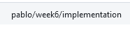
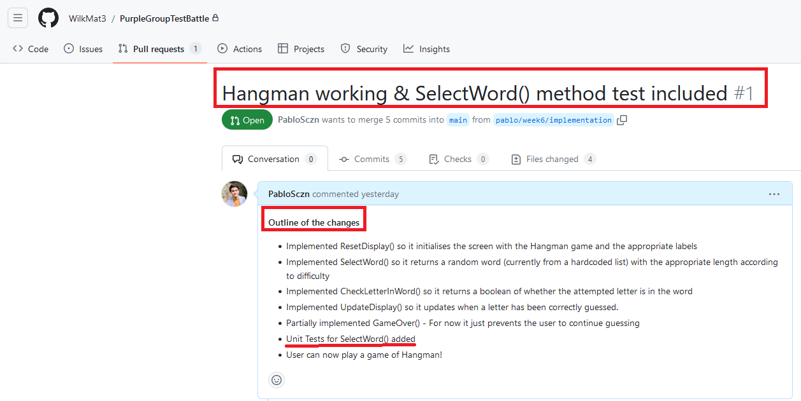
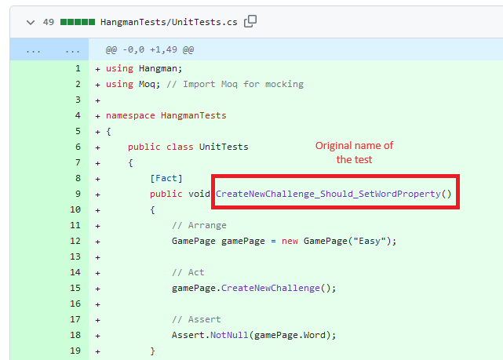

# Week 6: Testing

## Introduction

In this week's portfolio entry, I am going to highlight two key pieces of code that I implemented for the group Hangman project.
During this week, we created a group repo, and we performed the changes there. The [initial template](https://github.com/edinburgh-napier/SET09102_testing/tree/master) was taken from the practical briefing provided by the module leader. 
After creating the group repository, I then created the branch where I implemented my code
<br>

<br>

*Figure 1: My branch for the Hangman project.*
<br>

As a team, we wanted to have a basic implementation, which we could later expand and create tests for. I therefore programed a very basic implementation of the Hangman from the Template given and I created a [**Pull Request**](https://github.com/WilkMat3/PurpleGroupTestBattle/pull/1), outlining the changes I performed. 
This will allow the team to give feedback on my implementation and potentially change it if we decide on another member's implementation. For team members with more difficulties, it was also a good opportunity for them to have a working Hangman which they could create tests for (as I only added the tests for one method); and it was also useful for them to understand how the project worked, as I was at all times communicative with my team and open to helping them with their difficulties.

<br>

*Figure 2: My [Pull Request](https://github.com/WilkMat3/PurpleGroupTestBattle/pull/1) for the Hangman project.*
<br>


Thus, for this week's entry, I will highlight two key pieces of code that I implemented for the Hangman game. These examples showcase my coding skills and demonstrate my approach to testing and ensuring the game's functionality.

## Example 1: SelectWord()

### Code for the method

As outlined in my [Pull Request](https://github.com/WilkMat3/PurpleGroupTestBattle/pull/1), I implemented the method SelectWord() so it returns a random word (currently from a hardcoded list) with the appropriate length according to difficulty
```csharp
    /*!
	 * Uses the GameType to select a word from the list by its length:
     * Easy : length < 7
	 * Medium : 7 <= length < 10
	 * Hard : length >= 10
	 */
    public string SelectWord(string gameType)
    {
        // Harcoded list of strings
        List<string> wordList = new List<string> {
            "apple", "cat", "dog", "fish", "bird", "tree", "moon", "sun", "book", "lamp", "elephant", "giraffe", "cheetah", "octopus", "kangaroo",
            "platypus", "penguin", "rhinocer", "chocolate", "juxtaposition", "quizzical", "xylophone", "zoologist"
        };

        //Filtering by difficulty
        if (gameType == "Easy")
        {
            wordList.RemoveAll(word => word.Length > 7);
        }
        else if (gameType == "Medium")
        {
            wordList.RemoveAll(word => word.Length > 10 || word.Length < 7);
        }
        else if (gameType == "Hard")
        {
            wordList.RemoveAll(word => word.Length < 10);
        }

        Random random = new Random();
        int randomIndex = random.Next(0, wordList.Count);

        // Returns a random word after filtering the list of words
        return wordList[randomIndex];
    }
```
This method was important to test, because we needed to ensure that each game type (Easy, Medium, or Hard) returns a word matches the difficulty criteria for that game type. Hence, let's look at the tests I implemented for this method.

### Test Code

```csharp
 [Fact]
 public void Test_SelectWord_ReturnValidWordForEasyType()
 {
     // Arrange
     GamePage gamePage = new GamePage("Easy");

     // Act
     string selectedWord = gamePage.SelectWord("Easy");

     // Assert - The correct amount of characters are defined in the comments of GamePage cs file
     Assert.True(selectedWord.Length < 7);
 }

 [Fact]
 public void Test_SelectWord_ReturnValidWordForMediumType()
 {
     // Arrange
     GamePage gamePage = new GamePage("Medium");

     // Act
     string selectedWord = gamePage.SelectWord("Medium");

     // Assert - The correct amount of characters are defined in the comments of GamePage cs file
     Assert.True(7 <= selectedWord.Length && selectedWord.Length < 10);
 }
 [Fact]
 public void Test_SelectWord_ReturnValidWordForHardType()
 {
     // Arrange
     GamePage gamePage = new GamePage("Hard");

     // Act
     string selectedWord = gamePage.SelectWord("Hard");

     // Assert - The correct amount of characters are defined in the comments of GamePage cs file
     Assert.True(selectedWord.Length >= 10);
 }
```

I wrote these unit tests using the xUnit testing framework in C# to verify the functionality of the code. Here's an explanation of the tests:

### Test_SelectWord_ReturnValidWordForEasyType
- This test checks if the `SelectWord` method returns a word with a length less than 7 when the game type is set to "Easy."

### Test_SelectWord_ReturnValidWordForMediumType
- This test checks if the `SelectWord` method returns a word with a length between 7 and 10 (inclusive) when the game type is set to "Medium."

### Test_SelectWord_ReturnValidWordForHardType
- This test checks if the `SelectWord` method returns a word with a length greater than or equal to 10 when the game type is set to "Hard."

### Importance of Testing
Testing the `SelectWord` method was an important task because it ensures that the method correctly filters the word list based on the game type's difficulty and returns words that meet the specified criteria. This helps ensure that the game functions as intended, and players receive words that match the chosen difficulty level.

### Limitations of the Tests
These tests focus on the length of the selected word as the criteria for difficulty. However, they do not validate whether the word is selected randomly from the filtered list, and they don't account for cases where the word list may change in the future. Additionally, the test methods create a new `GamePage` instance for each test, which could potentially be optimized by sharing a common instance for multiple tests.


## Example 2: CreateNewChallenge()
This is a method that I did not implement. In fact, it was already on the [initial template](https://github.com/edinburgh-napier/SET09102_testing/tree/master). However, I created a test for this method.
The test is yet to be decided if we will implement it on our game implementation, however, you can find the test method I created for this method [on one of my commits on the repo](https://github.com/WilkMat3/PurpleGroupTestBattle/tree/pablo/week6/implementation).

### Code for the method
```csharp
    /* Creates a new Challenge */
    public void CreateNewChallenge()
    {
        Word = SelectWord(GameType);
        ResetDisplay(Word);
    }
```

The purpose of this method is to create a new challenge in a game by selecting a word based on the game type and setting the "Word" property of the game page. The selected word is then used for the game challenge. This is a crucial part of the code, as it is the one that creates the hangman challenge, so it was necessary to test it.

### Test Code
```csharp
        [Fact]
        public void Test_CreateNewChallenge_SetWordProperty()
        {
            // Arrange
            GamePage gamePage = new GamePage("Easy");

            // Act
            gamePage.CreateNewChallenge();

            // Assert
            Assert.NotNull(gamePage.Word);
        }
```

Please note, I have recently changed it the name to follow [Microsoft recommendation](https://learn.microsoft.com/en-us/dotnet/core/testing/unit-testing-best-practices)
Below is the screenshot of the commit in my Pull Request with the original name


<br>

*Figure 3: My test for the CreateNewChallenge() method for the Hangman project - Screenshot of my [first commit](https://github.com/WilkMat3/PurpleGroupTestBattle/commit/df843736fa7b09acb2ef50bc31d94e550826c6b7).*
<br>

### Explanation of the Test
I wrote a unit test, `Test_CreateNewChallenge_SetWordProperty` (updated name), to verify that the `CreateNewChallenge` method successfully sets the "Word" property of the `GamePage` instance to a non-null value after creating a new challenge.

### Importance of Testing
Testing this aspect of the code is important because it ensures that the `CreateNewChallenge` method functions correctly in setting the challenge word for the game. If this method fails to set the word property, it would impact the gameplay, as the challenge word is a fundamental part of the game.

### Limitations of the Test
The test checks if the "Word" property is not null, but it does not validate if the word is set correctly based on the game type, as the exact word value is not checked. To enhance the test, we could also check that the selected word matches the expected word for the given game type to ensure the method functions as intended.


## Reflection

During this week's work on the Hangman implementation, I faced several challenges, including the effective collaboration within the team. As the code implementation for Hangman was shared among team members, it was crucial to ensure that our code was coherent, and each member's contributions aligned with the project's goals. For that reason, I actively participated in discussions, offered assistance to team members facing challenges, and maintained clear communication. Thanks to this, we were able to resolve conflicts and ensure that our code worked harmoniously within the project.

Moreover, testing posed a challenge due to the complexity of the code, as I had not previously worked with xUnit much. I chose to focus my initial tests on specific methods, such as SelectWord() and CreateNewChallenge(), as these were crucial components of the game, and learned about Unit Testing in order to write functional tests.

In summary, this week's portfolio entry taught me some important lessons. I realised the significance of teamwork, clear communication, and helping each other out. Testing our code was challenging, and I'm aware that there's still more work to be done. But I'm committed to improving my coding skills and being a supportive team member. 

## References
- [xUnit Documentation](https://xunit.net/)
- [Walkthrough: Create and run unit tests for managed code](https://learn.microsoft.com/en-us/visualstudio/test/walkthrough-creating-and-running-unit-tests-for-managed-code?view=vs-2022)