# Week 8: Team Project 01

## Issue Description

For this week, I tackled an essential issue from our project backlog titled:

> As an UNDAC Team Leader, I want to view lists of partner agencies (UN, International, national, NGO, voluntary) so that I can recruit them into the team.

**End User Goal**: To identify appropriate partner agencies and invite them to join the team efficiently.

**End Business Goal**: To ensure that teams have access to appropriate external resources and support.

The issue's acceptance criteria included listing partner agencies with their current association status, facilitating easy agency detail viewing, enabling full-text search for filtering. Citing the [description of the issue found on the module's repo](https://github.com/edinburgh-napier/SET09102/blob/main/practicals/issues/week_8.md):

### Acceptance Criteria
1. Partner agencies can be listed with their current association status (e.g., 'requested', 'confirmed', etc.).
2. Agency details can be viewed easily.
3. Full-text search can be used to filter the list of agencies.
4. Filters can be cleared.

## Work Summary
I completed the given task and was able to meet the acceptance criteria. My work was based on a previous implementation by one of my teammates (Mateusz Wilczynski), who provided the team with a CRUD implementation for one of the issues, and thus, giving us a blueprint for the rest of implementations. His [Pull Request can be found on this link](https://github.com/xinjoonha/SET09102_PURPLE/pull/55).
After reviewing his implementation (in which I did not find any issues), I worked on my own issue and after completing it, [I made a Pull Request, which can be found here](https://github.com/xinjoonha/SET09102_PURPLE/pull/59)<br>

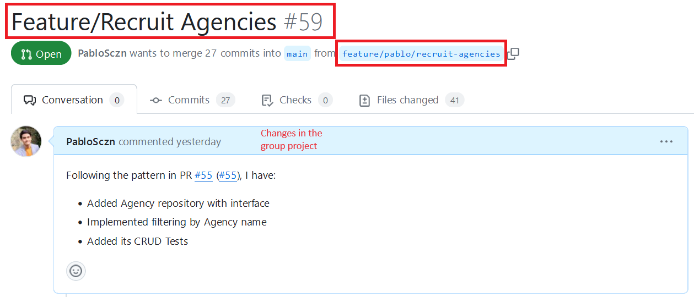<br>
*Figure 1: My [Pull Request](https://github.com/xinjoonha/SET09102_PURPLE/pull/59) for this week's issue.*
<br>

### Code Implementation

In order to complete this issue, I created an `Agency` class, with the attributes: *Id, Name, Type, Status, ContactPerson, ContactEmail, ContactPhone, StatusChangedDate and Note*.
Having that as a Model, I also created an `AgencyRepository` class, which initialises the data with some values. In specific, with *UN, International, national, NGO and voluntary* **agencies**, as per the issue specification. Below is the code for the agencies I added:
```csharp
var dummyAgencies = new List<Agency> {
    new Agency
    {
        Name = "UN Agency",
        Type = "UN",
        Status = "Requested",
        ContactPerson = "UN Contact",
        ContactEmail = "un@example.com",
        ContactPhone = "07123456789",
        StatusChangedDate = DateTime.Now.AddMonths(-2),
        Notes = "This is a UN agency."
    },
    new Agency
    {
        Name = "International Agency",
        Type = "International",
        Status = "Confirmed",
        ContactPerson = "International Contact",
        ContactEmail = "international@example.com",
        ContactPhone = "+34 619107717",
        StatusChangedDate = DateTime.Now.AddMonths(-2),
        Notes = "This is an international agency."
    },
    new Agency
    {
        Name = "National Agency",
        Type = "National",
        Status = "Requested",
        ContactPerson = "National Contact",
        ContactEmail = "national@example.com",
        ContactPhone = "07132457689",
        StatusChangedDate = DateTime.Now.AddMonths(-2),
        Notes = "This is a national agency."
    },
    new Agency
    {
        Name = "NGO Agency",
        Type = "NGO",
        Status = "Confirmed",
        ContactPerson = "NGO Contact",
        ContactEmail = "ngo@example.com",
        ContactPhone = "07987654321",
        StatusChangedDate = DateTime.Now.AddMonths(-2),
        Notes = "This is an NGO agency."
    },
    new Agency
    {
        Name = "Voluntary Agency",
        Type = "Voluntary",
        Status = "Requested",
        ContactPerson = "Voluntary Contact",
        ContactEmail = "voluntary@example.com",
        ContactPhone = "07123456789",
        StatusChangedDate = DateTime.Now.AddMonths(-2),
        Notes = "This is a voluntary agency."
    }
};

foreach (var agency in dummyAgencies)
    await SaveAsync(agency);
```

I also worked on the UI class. I, thus, created `AllAgenciesPage` in our project. This is a XAML CS code which offers an efficient way for users to interact with the partner agencies. Here's an overview of my code implementation:

- **Initialization:** I started the `AllAgenciesPage` class, initialising critical components, and setting up event handlers for filtering. This initialization ensures a smooth user experience.

- **Loading Agencies:** To populate the UI with partner agencies, I implemented the `LoadAllAgencies()` method, ensuring that it fetches data asynchronously and displays it correctly.

- **Filtering Agencies:** The code includes a user-friendly filtering mechanism that allows users to search for agencies by name. The ListView updates dynamically as users type, providing real-time feedback. Below is the code snippet with my code:
```csharp
    /// <summary>
    /// This method handles the filtering of the list of agencies
    /// </summary>
    /// <param name="sender"></param>
    /// <param name="e"></param>
    public void FilterAgencies(object sender, EventArgs e)
    {
        var filteredAgencies = allAgencies;

        // Apply filters
        if (!string.IsNullOrWhiteSpace(NameSearchBar.Text))
        {
            string nameFilter = NameSearchBar.Text.ToLower();
            filteredAgencies = filteredAgencies.Where(agency => agency.Name.ToLower().Contains(nameFilter)).ToList();
        }

        // Update the ListView with filtered data
        AgenciesListView.ItemsSource = filteredAgencies;
    }
```

- **Navigation:** I added a method, `OnAgencyClicked()`, that enables users to navigate to an `EditAgencyPage` for further interactions with the agency clicked.

This `EditAgencyPage` manages the case where the user wants to change the status of an Agency. Therefore, I implemented a `OnStatusChanged` method that updates the status of the agency. Below is the code for this method:
```csharp
    /// <summary>
    /// This method updates the status of the agency
    /// </summary>
    /// <param name="sender"></param>
    /// <param name="e"></param>
    public async void OnStatusChanged(object sender, EventArgs e)
    {
        if (PickerStatus.SelectedIndex >= 0)
        {
            agency.Status = (string)PickerStatus.SelectedItem;
            agency.StatusChangedDate = DateTime.Now;

            await _agenciesRepo.SaveAsync(agency);
            await Navigation.PopAsync();
        }
    }
```

Note that it also updates the date when the status has changed.


This demonstrates that in my code implementation, I made sure to follow clean code principles for better readability and maintainability:

- **Descriptive Class and Method Names**: I created classes with clear names like `Agency`, `AgencyRepository`, and `AllAgenciesPage` to reflect their purpose.
Also, methods like `OnStatusChanged` have descriptive names and comments to clarify their purpose.

- **Helpful Comments**: I added comments to explain methods and important code sections, making it easier for my teammates to understand what's happening. I also adhered to the `doxygen.md` file in our group repo.

- **Meaningful Variables**: I used meaningful variable names like `dummyAgencies`, `filteredAgencies`, and `nameFilter` to make it clear what each variable does.

- **Async Operations**: I used `async` and `await` for asynchronous operations, ensuring the user interface remains responsive during data operations.

- **Dynamic ListView**: The code updates the ListView in real-time during filtering, improving the user experience.

These practices improved the code's quality and make it more helpful for the team.


### Results
As I mentioned above, I managed to fully implement this issue, and therefore, the result was that the user can see the agencies, filter them and update them. Below are some screenshots of my implementation <br>

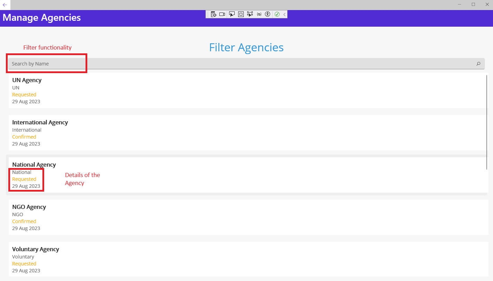<br>
*Figure 2: Manage Agencies page.*
<br>


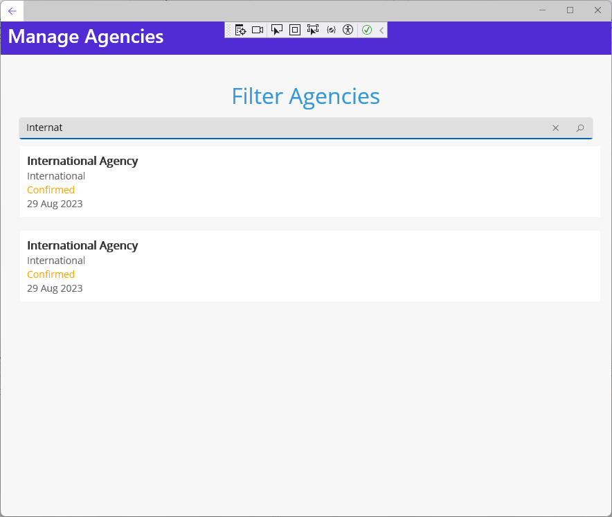<br>
*Figure 3: Filtering Agencies.*
<br>

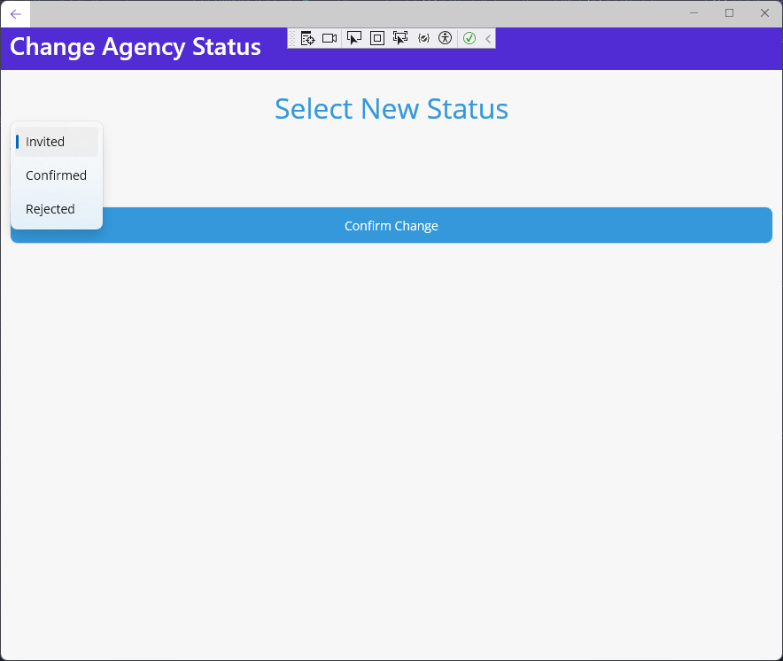<br>
*Figure 4: Change Agency Status.*
<br>


## Code Testing

As I understand the need for code reliability and functionality, I implemented thorough tests, including:

- **Add Agency Test:** This test verified that agencies could be added to the system without issues and that their attributes were stored accurately in the database.
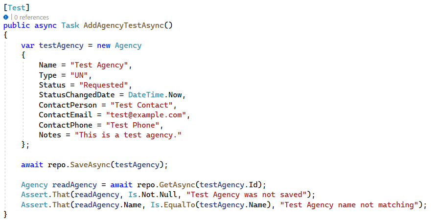<br>
*Figure 5: Add Agency Test.*
<br>


- **Delete Agency Test:** I confirmed that agencies can be deleted without errors, and the associated data is removed from the database.
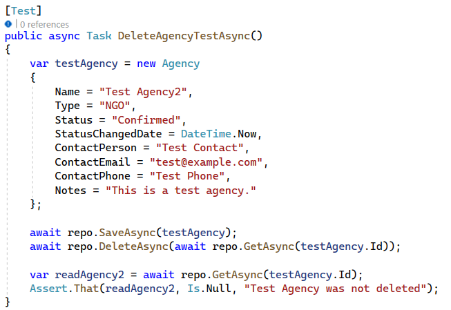<br>
*Figure 5: Add Agency Test.*
<br>


- **Get Agencies Test:** This test validated the retrieval of agencies, ensuring that the code retrieves the correct agencies from the database.
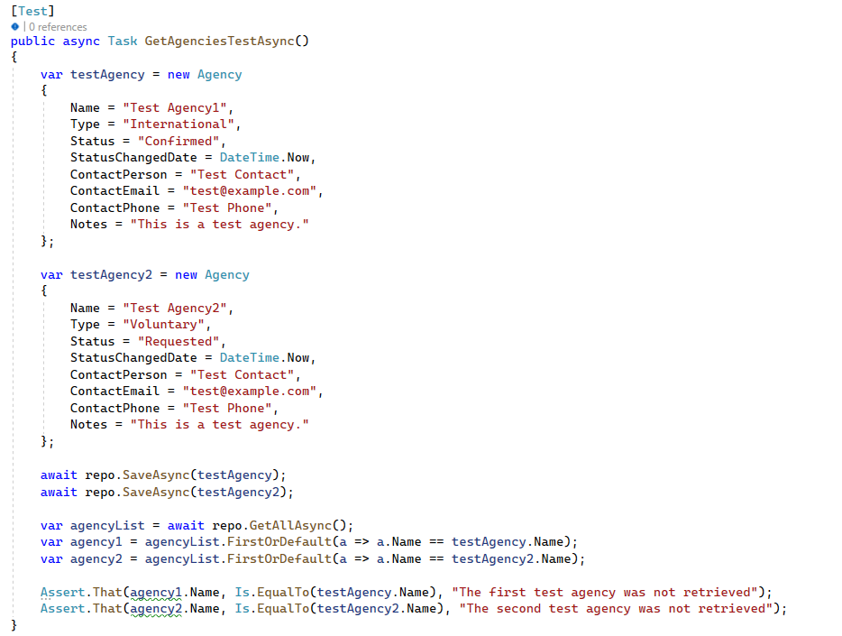<br>
*Figure 6: Get Agency Test.*
<br>

## Code Reviews

### Code Review I provided
As I mentioned above, I provided a Review for my teammate Mateusz Wilczynski. However (and luckily), I did not find any issues with his implementation <br>
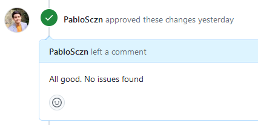<br>
*Figure 7: Review 1: No issues found.*
<br>

However, I was also asked to review the code for other of my teammates ([Mateusz Pasternak](https://github.com/xinjoonha/SET09102_PURPLE/pull/60)), for his Pull Request, and I found some minor errors with his implementation.
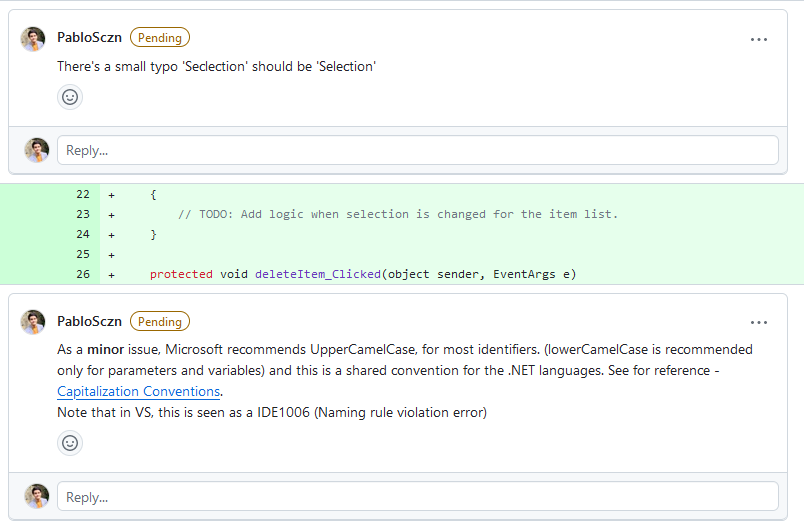<br>
*Figure 8: Review 2: Naming issues found.*
<br>

Although the errors were minor, I made sure to include a comprehensive description and also a reference resource for my teammate to look at regarding [Capitalisation conventions](https://learn.microsoft.com/en-us/dotnet/standard/design-guidelines/capitalization-conventions?redirectedfrom=MSDN).
Therefore, after finding these issues, I requested changes in order to merge his implementation
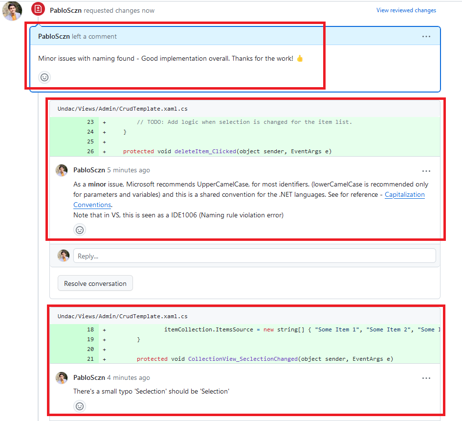<br>
*Figure 9: Review 2: Changes I requested.*
<br>

As the issues were only regarding capitalisation and a typo, this error was easy to fix.

### Code Review provided to me
Luckily, the reviews I received were positive and no issues were found in my implementation. <br>
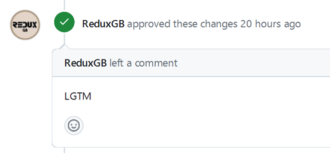<br>
*Figure 10: Review provided to me.*
<br>


## Reflection

### New Realisations

This week, I worked on an important project task that allowed me to learn and to note and learn several things:

1. **Team Collaboration**: I had the opportunity to collaborate closely with my team members, particularly in code reviews. It was great to see how our collective efforts contributed to the project's progress. I, therefore, noted the significance of effective teamwork and communication in achieving our goals.

2. **Clean Code Practices**: While working on my code implementation, I strived to follow clean code principles. I understood the importance of writing code that is easy to understand and maintain. This additionally, benefits my teammates who may need to work with my implementation in the future.

3. **Code Testing**: I implemented tests to ensure the reliability and functionality of my code. I am sure that testing will allow us as a team to indetify future problems with our code and is already a valuable knolewdege to learn and practice.

4. **Review Process**: I experienced the code review process from both sides – as a reviewer and as someone receiving feedback. It highlighted the value of constructive feedback in improving code quality. Providing detailed feedback and suggestions for improvement is just as important as receiving it with an open mind in my opnion, and I am happy with the way that we are giving each other feedback.

5. **GitHub Collaboration**: Our project heavily relies on GitHub for version control and collaboration. I realized how crucial it is to maintain a well-structured repository, use branches effectively, and manage pull requests efficiently to keep the development process organised and streamlined. This was as well one of the most difficult challenges of this week, as we had to streamline all our implementations to avoid conflict in our code.

6. **Responsibility and Accountability**: Taking on a specific project task gave me a sense of responsibility and accountability. I had to ensure that my work met the project's requirements and was aligned with our team's goals.

### Common Problems in Team Development

As mentioned before, streamlining our implementations was the most challenging bit of this week. Although I believe we did a good job, we did find some issues:

1. **Communication Issues**: Effective communication is key in a team project. Problems can occur when team members do not clearly express their ideas or do not actively engage in discussions. This can lead to misunderstandings, delays, and misaligned objectives. We had to delay our reviews and implementations for some time, because at first, communication was not very smooth.

2. **Integration Challenges**: Combining code contributions from multiple team members can be challenging. Issues such as merge conflicts and compatibility problems appeared, which required careful version control management and coordination.

3. **Incomplete or Insufficient Testing**: Inadequate testing can result in undetected bugs and issues, impacting the overall quality of the project. We still have to work on this aspect, as we are aware that we could make use of more and more complete tests.


### Comparing My Practice to Others

In comparison to my team members, I found that my code implementation adhered to clean code practices, with descriptive class and method names, meaningful variable names, and helpful comments. This not only improved the readability and maintainability of my code but also made it more accessible to my teammates.

During code reviews, I was able to provide constructive feedback to one of my teammates, addressing minor naming and capitalisation issues. While my code reviews revealed the ability to identify potential improvements in code quality, I truly believe that it's essential to provide feedback in a constructive and supportive manner, focusing on continuous improvement rather than criticism.

In terms of project management, I ensured that my contributions were well-documented and organized within the GitHub repository, making it easier for team members to track my progress and understand the purpose of my code. These documentation can be seen in [my Pull Request](https://github.com/xinjoonha/SET09102_PURPLE/pull/59)

As always, there is always room for improvement, and I am committed to improving my skills and collaboration with my team to ensure a positive outcome.


 ## References
- [Clean Code: A Handbook of Agile Software Craftsmanship by Robert C. Martin](https://www.goodreads.com/en/book/show/3735293-clean-code)
- [Effective Software Testing: 50 Specific Ways to Improve Your Testing by Elfriede Dustin](https://www.goodreads.com/en/book/show/113731.Effective_Software_Testing)
- [Capitalization Conventions](https://learn.microsoft.com/en-us/dotnet/standard/design-guidelines/capitalization-conventions?redirectedfrom=MSDN)

## Additional Details
- Code Repository: [Link to GitHub Repository](https://github.com/xinjoonha/SET09102_PURPLE)