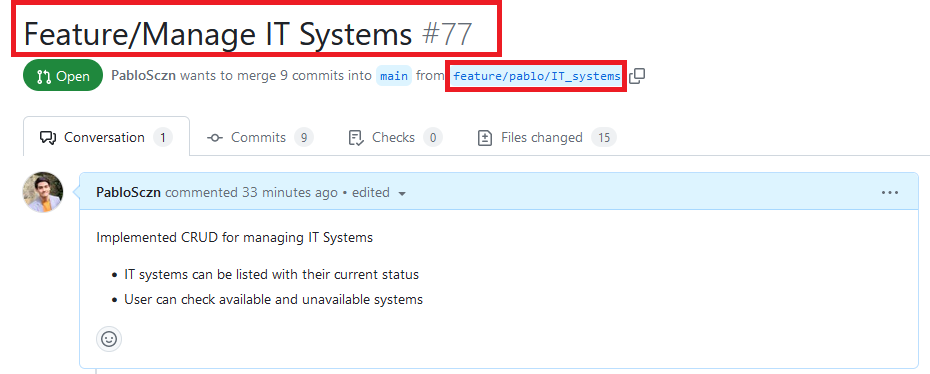
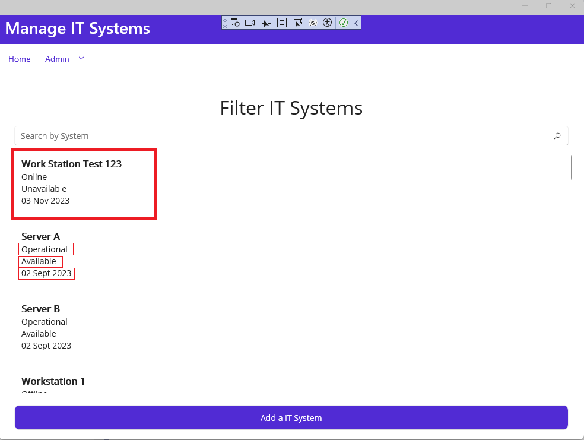
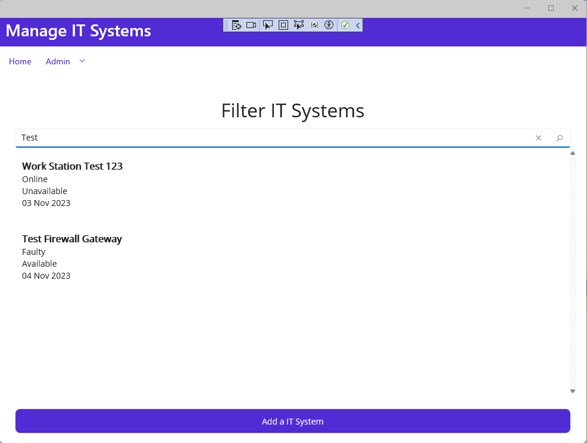
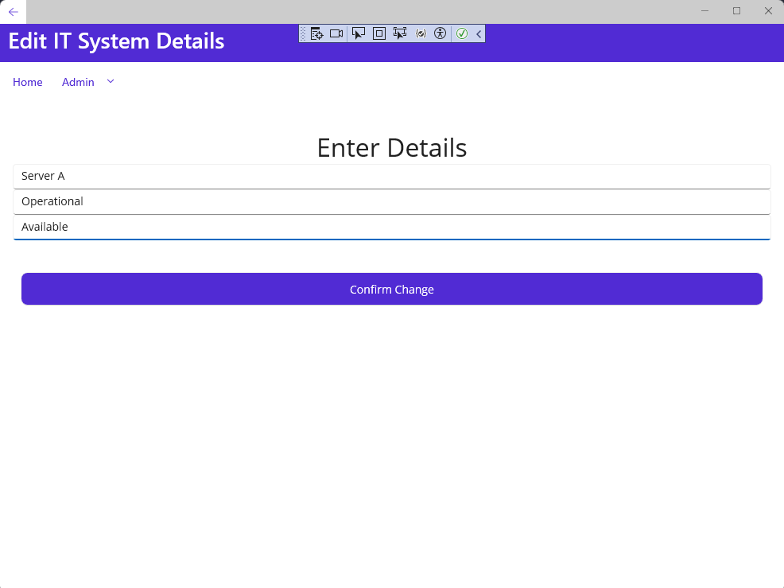
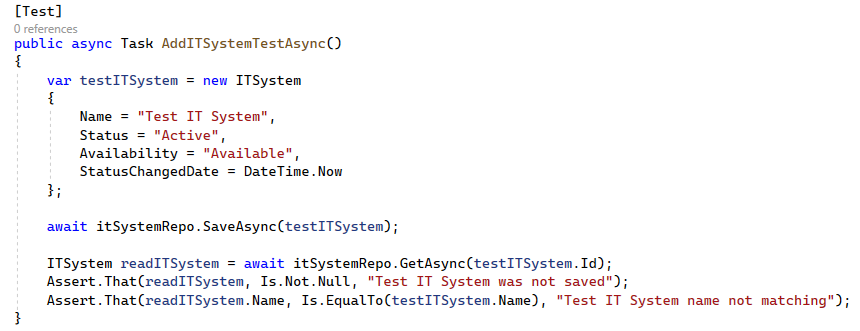
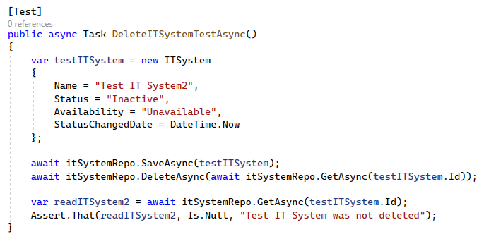
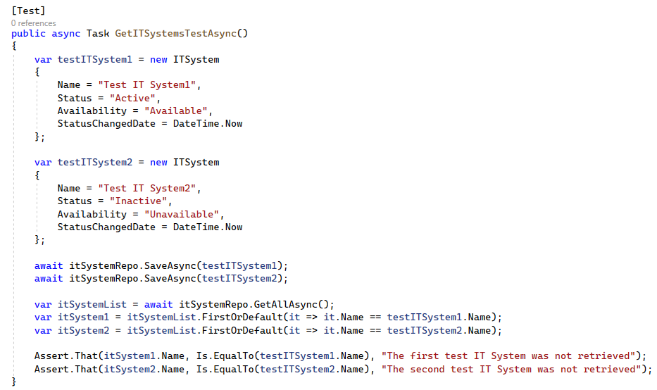
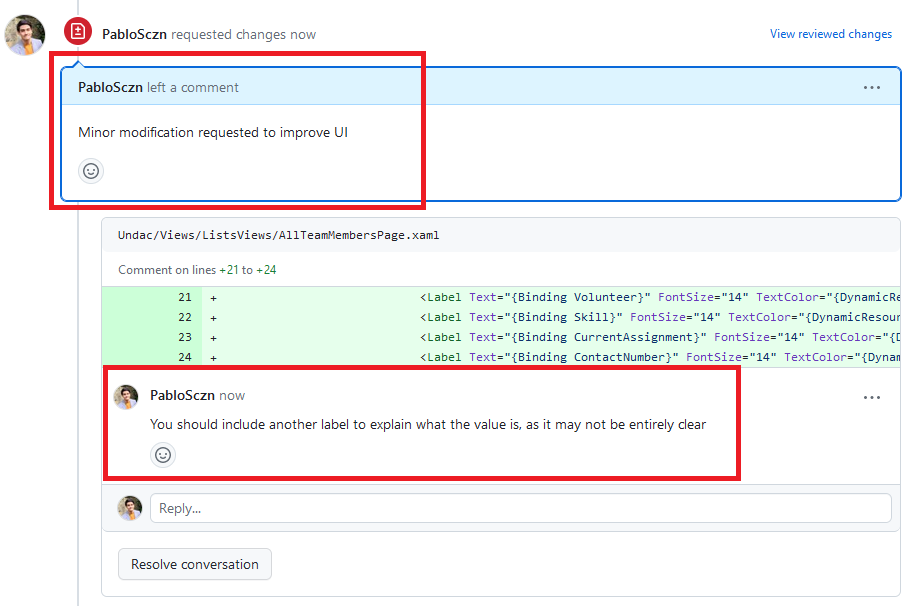
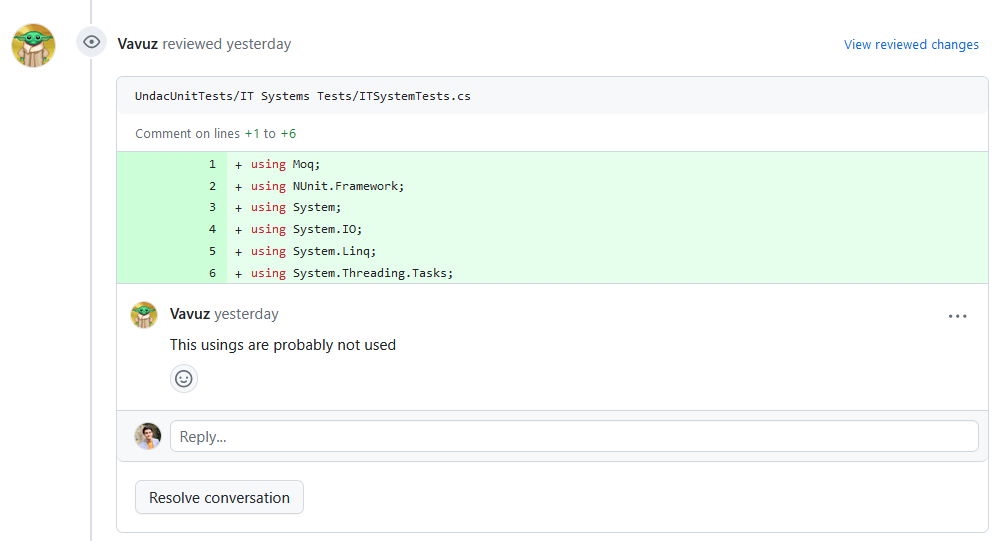
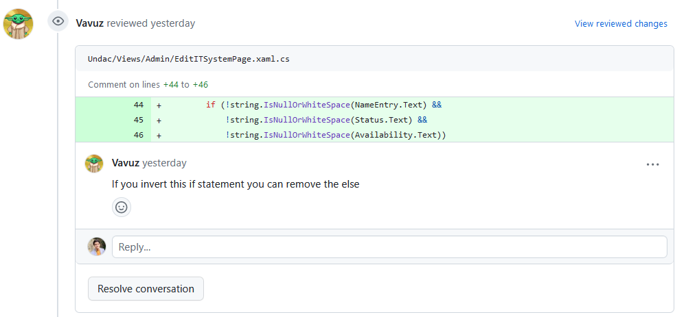

# Week 9: Team Project 02

## Issue [#55](https://github.com/xinjoonha/SET09102_PURPLE/issues/57)

This week, I addressed a critical issue from our project backlog, titled:

> As an UNDAC Deputy Team Leader, I want to view the status of all team IT systems so that I can take appropriate action in case of failure, temporary unavailability, or a reduction in service.

**Acceptance criteria:**

* IT systems can be listed with their current status
* Available an unavailable systems are clearly differentiated

The complete description of the issue can be found [here](https://github.com/edinburgh-napier/SET09102/blob/main/practicals/issues/week_8.md).

## Work Summary

I successfully completed the assigned task, meeting the specified acceptance criteria. My work built upon previous implementations that we have been doing for the last weeks. However, this time, I paid more attention to the UI, as we decided as a team, to have a common UI structure for all our implementations. The UI template was provided by one of my Team Members, [Mateusz Pasternak](https://github.com/OwlZeroOne), who worked on its implementation, and submitted the following [Pull Request](https://github.com/xinjoonha/SET09102_PURPLE/pull/60). This was merged to the main branch, and provided the team with a nice UI blueprint which ensured that we all had similar UI for our implementations.

Therefore, after a comprehensive review of the implementation, I proceeded to work on my issue. Upon its completion, I submitted a Pull Request, available [here](https://github.com/xinjoonha/SET09102_PURPLE/pull/77).

<br>
*Figure 1: My Pull Request.*

### Code Implementation

As in this issue I needed to create a page for managing IT systems, I created a class called `ITSystem`. This class had the following attributes: *Id, Name, Status, Availability, and StatusChangedDate*. 
Once created the class as a model, I created `ITSystemRepository` and its interface, `IITSystemRepository`.
At first, I was not going to initialise values to the database, but for testing and demonstration purposes I considered that it would be useful to have some initial data on the database. Thus, I added the initial dummy IT systems in the database: *Server A, Server B, Workstation 1, Workstation 2, and Firewall Gateway*.

In terms of the UI, as I mentioned before, I adhered to the UI template that we agreed in the team. However, I added an extra View, to be able to see and edit the details of a selected IT System. Thus, I created `AllITSystemsPage` and `EditITSystemPage` in our project. As per my previous entry, `AllITSystemsPage` is very similar to other CRUD functionalities that we have worked on. In short, this is a XAML CS code to manage the IT systems view. My implementation included the following:

- **Initialisation**: I initialized the `AllITSystemsPage` class, set up essential components, and established event handlers for filtering, ensuring a user-friendly interface.

- **Loading IT Systems**: I implemented the `LoadAllITSystems()` method to fetch IT systems asynchronously and display them accurately on the user interface.

- **Filtering IT Systems**: The code includes a user-friendly filtering mechanism that allows users to search for IT systems by name. The ListView updates dynamically as users type, providing real-time feedback.

```csharp
    /// <summary>
    /// This method handles the filtering of the list of IT systems
    /// </summary>
    public void FilterITSystems(object sender, EventArgs e)
    {
        var filteredITSystems = allITSystems;

        // Apply filters
        if (!string.IsNullOrWhiteSpace(FullTextSearchBar.Text))
        {
            string nameFilter = FullTextSearchBar.Text.ToLower();
            filteredITSystems = filteredITSystems.Where(itSystem => itSystem.Name.ToLower().Contains(nameFilter)).ToList();
        }
        // Update ITSystemsListView with filtered data
        ITSystemsListView.ItemsSource = filteredITSystems;
    }
``` 

- **Navigation**: I added a method, `OnITSystemClicked()`, that enables users to navigate to an `EditITSystemPage` for further interactions with the selected IT system.
```csharp
    /// <summary>
    /// This method handles the navigation to EditITSystemPage when selecting a system
    /// </summary>
    private async void OnITSystemClicked(object sender, ItemTappedEventArgs e)
    {
        if (e.Item is ITSystem itSystem)
        {
            await Navigation.PushAsync(new EditITSystemPage(itSystem, itSystemsRepo));
        }
    }
```


Therefore, I also added a view to manage the creation or edition of IT Systems. Here is a quick breakdown of the `EditITSystemPage` page:
- **Class Definition:**
  This code defines the `EditITSystemPage` class, which inherits from `ContentPage`. This class represents the UI page for editing or creating an IT system.

- **Fields and Constructor:**
  - `itSystem`: This field holds an instance of the `ITSystem` class, representing the IT system being edited or created.
  - `_itSystemsRepo`: This field stores an instance of the `IITSystemRepository` interface, presumably used for data storage or retrieval.
  - The constructor `EditITSystemPage` takes two parameters: `itSystem` and `_itSystemsRepo`. It initializes these fields and checks whether an IT system is being created or edited. If it's a new IT system (null), the page is titled "Create IT System," and if it's an existing IT system, the page is populated with its details.

- **`OnStatusChanged` Method:**
  - This method is responsible for updating the IT system when the status is changed.
  - It checks if the required fields (`NameEntry.Text`, `Status.Text`, and `Availability.Text`) are not empty or null. If they are, it proceeds with the update.
  - If the IT system is null (indicating the creation of a new IT system), it initializes a new `ITSystem` object.
  - It updates the IT system's attributes with the data entered by the user and sets the `StatusChangedDate` to the current date and time.
  - The method then calls the `_itSystemsRepo.SaveAsync(itSystem)` method to save the IT system asynchronously.
  - Finally, it navigates back to the previous page using `Navigation.PopAsync()` to confirm the update.
  - If any of the required fields are missing, it displays an error alert to the user.

```csharp
    /// <summary>
    /// This method updates the IT System
    /// </summary>
    public async void OnStatusChanged(object sender, EventArgs e)
    {
        if (!string.IsNullOrWhiteSpace(NameEntry.Text) &&
            !string.IsNullOrWhiteSpace(Status.Text) &&
            !string.IsNullOrWhiteSpace(Availability.Text))
        {
            // IT System is null if we are creating one
            itSystem ??= new ITSystem();

            itSystem.Name = NameEntry.Text;
            itSystem.Status = Status.Text;
            itSystem.Availability = Availability.Text;
            itSystem.StatusChangedDate = DateTime.Now;

            await _itSystemsRepo.SaveAsync(itSystem);
            await Navigation.PopAsync();
        }
        else
            await DisplayAlert("Error", "A field is missing", "OK");
    }
```

My implementation for this issue was also focused on adhering to clean code principles for better readability and maintainability. Here are the key clean code principles I followed:

- **Modular and Cohesive Classes**: I ensured that each class had a single responsibility, making them more modular and focused. This practice simplifies code understanding and maintenance.

- **Code Consistency**: I maintained a consistent coding style and formatting on all the project. Consistency in naming conventions, indentation, and code structure enhances code quality.

- **Clear and Concise Methods**: I wrote methods that were clear and concise, with each method having a single, well-defined purpose. This approach improved code readability and made debugging easier.

- **Elimination of Code Duplication**: I actively avoided duplicating code by encapsulating common functionality in reusable methods and classes. This practice reduces the risk of errors and simplifies future updates.

- **Meaningful Variable Names**: I used meaningful variable names that conveyed their purpose and usage. Descriptive variable names make the code self-documenting and easier to understand.

- **Testable Code**: I designed the code to be testable, separating business logic from UI concerns and using dependency injection. This design allows for effective unit testing and future code expansion.

By adhering to these clean code principles, I aimed to improve the overall quality and maintainability of the project.


### Results

My implementation successfully met the issue requirements, allowing users to view, filter, and update the status of IT systems. Below are screenshots of my implementation:

<br>
*Figure 2: IT Systems Page.*

<br>
*Figure 3: Filtering IT Systems.*

<br>
*Figure 4: Changing IT System Status.*

## Code Testing

I recognised the significance of code reliability and functionality, and therefore, I implemented comprehensive tests:

- **AddITSystemTestAsync**: This test verified the ability to add IT systems to the system without errors and ensured that their attributes were accurately stored in the database.
<br>
*Figure 5: Add IT System Test*

- **DeleteITSystemTestAsync**: This test confirmed that IT systems can be deleted without issues, with associated data removed from the database.
<br>
*Figure 6: Delete IT System Test*

- **GetITSystemsTestAsync**: This test validated the retrieval of IT systems, ensuring that the code fetches the correct IT systems from the database.
<br>
*Figure 7: Get IT System Test*


## Code Reviews

### Code Review Provided by Me

I reviewed the code submitted by my teammate, [Marco Vavassori](https://github.com/Vavuz) and I found a minor issue. While reviewing his implementation, I identified that there were some labels that were not clear enough, so I provided feedback to make more descriptive labels and a better UI for the project. His Pull Request with my comments can be found [here](https://github.com/xinjoonha/SET09102_PURPLE/pull/76).
<br>
*Figure 8: Changes Requested by me*

After addressing the issues, my teammate's implementation was updated and ready for merging.

### Code Review Received

I received positive feedback in the code review process. However, Marco also found minor issues in my implementation and he let me know. There were some 'usings' that were unnecessary in my code, and I could delete them and he also found that I could simplify an 'if statement'. This feedback helped me greatly to improve and simplify my code, and thus, provide better value to the team. 
<br>
<br>
*Figure 8 & 9: Change Requested by teammate*


## Week 9 Reflection

### New Things I Realised this Week

During this week, I gained valuable insights and experiences working on our team project. As this is the second week working in the issues, there is still a lot to learn, but I strongly believe that I have grown a lot since the start of the module. Here are some of the new things I realised:

1. **Team Collaboration requires active communication:** This week, I was reminded of the importance of effective teamwork in achieving our project goals. Collaborating with my team members, providing feedback, and addressing each other's concerns was crucial to complete this week's task. Although I have already talked about team collaboration on the last entry, this week showed me that in order to mantain an effective teamwork, we need to be consistently communicating.

2. **Consistency Matters:** I learned the importance of consistency in our project, especially in terms of UI. Creating a common UI template for all our implementations not only enhanced the user experience but also streamlined our development process. We have started a conversation on how we can make our tests more consistent as well.

3. **Clean Code is Crucial:** I re-emphasised the importance of clean code principles. Writing modular, well-organized, and readable code not only makes it easier for team members to understand and maintain the code but also facilitates code testing and future expansions.

4. **Feedback Improves Quality:** Both providing and receiving feedback were instrumental in refining our project. Through code reviews, we were able to identify areas for improvement and we were able to perform better work.

### Common Problems in Team Development

Working in a team development situation, we encountered and observed some common problems that arised during this week:

1. **Coding Style Conflicts:** Inconsistent coding styles among team members could lead to confusion and code that is challenging to read and maintain. To mitigate this, we stablished coding conventions and follow them consistently. This is a good example of where the constant communication was key.

2. **Differing Skill Levels:** Team members in our group have varying levels of coding and experience, which could potentially lead to disparities in code quality. The way we mitigated this was through feedback, continuous help, and once again, active communication.

3. **Scope Creep:** Expanding the project scope beyond what was initially planned can lead to delays and complications. Creating a common UI was crucial to ensure that the program could function correctly and consistently

### Comparing My Practice to Others

In comparing my practice to other team members, I found that each of us has unique strengths and areas for improvement. Here's how my practice compares to that of my teammates:

1. **Attention to UI Details:** In this week's task, I focused on enhancing the UI, which was an area of strength for me. I ensured that our UI adhered to the common template we agreed upon, providing a consistent user experience.

2. **Clean Code Emphasis:** I placed a strong emphasis on clean code principles, which was evident in my code structure and organisation. This practice contributed to improved code readability and maintainability.

3. **Feedback and Collaboration:** I actively engaged in code reviews and provided feedback to my teammates, helping them improve their implementations. I also benefited from feedback provided by my team, which allowed me to enhance the quality of my work.

4. **Learning from others:** I learned from my teammates' code and appreciated their different coding styles and approaches. The feedback received from team members, such as code simplifications and removal of unnecessary code, contributed to my own learning and growth.

As a conclusion, during this week I found that by actively collaborating and learning from one another, we can collectively work towards creating a better project.

## References
- [Clean Code: A Handbook of Agile Software Craftsmanship by Robert C. Martin](https://www.goodreads.com/en/book/show/3735293-clean-code)

## Team Repository
- Code Repository: [Link to GitHub Repository](URL_TO_TEAM_REPO)
